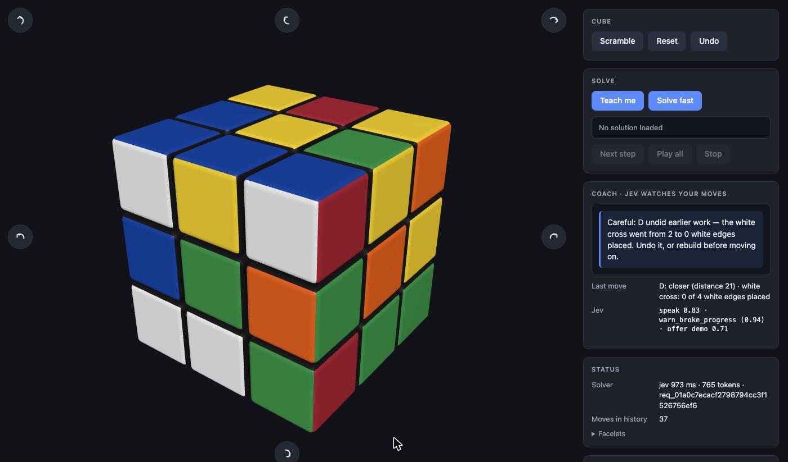

# jev-rubiks

An interactive 3D Rubik's cube where **code solves and [Jev](https://typesafe.ai) understands**.

You turn the cube by hand — drag a sticker, orbit with the mouse, rotate the whole cube with the
curved arrows. Two code solvers can finish it for you (Kociemba two-phase, ~20 ms) or teach you
step by step (beginner layer-by-layer, every step explained). And a coach powered by TypeSafe's
Jev model watches every move you make and decides, on its own judgment, when to stay quiet, when
to warn you that you just undid your own work, when to celebrate a milestone, and when to offer
to show you the next step.



*Above: two white edges placed by hand while the coach stayed silent, then a careless `D`. The
coach's message, the facts code computed for that move, and Jev's raw judgment
(`speak 0.83 · warn_broke_progress (0.94)`) are all on screen.*

## What Jev does here — and what it doesn't

Jev is a *System One* model: it returns calibrated probabilities over options you define, fast,
from a plain-English description of a situation. It does not generate text, search, or compute.

That shapes the split:

| Job | Who | Why |
|---|---|---|
| Turning layers, tracking state, undo | code | exact permutation tables |
| Solving (fast) | code — Kociemba via `cubejs` | search problem; ≤ 22 moves in ~20 ms |
| Teaching (step by step) | code — beginner method in this repo | named stages, explainable steps |
| Deciding *whether and how* to coach | **Jev** | fuzzy judgment over facts, no rule table |

After each move you make by hand, code computes the facts — which beginner stage you are in, how
many pieces of it are placed, whether the last move undid earned work, how many moves since a piece
was last placed, how long since progress, how long the coach has been quiet — and sends them to Jev
as plain English, with three questions:

- `should_speak` — speak now, or stay quiet?
- `message_kind` — `celebrate_milestone` · `warn_broke_progress` · `help_stuck` · `explain_stage_goal` · `nothing`
- `offer_demo` — would a "Show me" button help right now?

Code keeps the last word: thresholds on Jev's probabilities, a minimum streak before "stuck" help
(beginner algorithms run up to ~8 moves whose middle looks like no progress), and pre-written
messages filled with the real facts and the real next algorithm. The panel shows Jev's raw judgment
for every move — `speak 0.91 · help_stuck (1.00) · offer demo 0.92` — so you can watch it decide.

**We also tried letting Jev pick moves directly.** Code described the six faces in colour names and
asked for the best of 18 moves, forty times in a row. It was no better than random (Kociemba
distance 22 → 22, random walk 22 → 21): judging which turn helps requires simulating the cube, and
that is a computation, not a judgment. The experiment is gone; the finding is why the coach exists.

## Run it

Requires Node ≥ 20 and a TypeSafe API key.

```bash
npm install
cp .env.example .env        # put your TYPESAFE_API_KEY in .env (git-ignored)
npm run dev                 # http://localhost:5173
```

The browser never talks to `api.typesafe.ai` directly — its CORS policy rejects browser origins, and
the key must not ship to the page. The Vite dev server proxies `/api/typesafe` and injects the key.

## Verify it

```bash
npm run check       # typecheck + lint + 85 unit tests (cube model cross-checked against cubejs,
                    # 200 Kociemba solves, 600 beginner-solver scrambles, reducer, coach facts)
npm run test:e2e    # Playwright: drag-to-turn, fast solve, teach-mode playback
npm run test:live   # 9 coach situations against the real model; tunes src/jev/thresholds.ts
npm run jev:ping    # one trivial request to confirm the key
```

## Layout

```
src/cube/       pure cube model: 54-facelet state, moves, notation, orientation, scramble
src/solver/     kociemba.ts (cubejs wrapper, worker) · beginner/ (7 stages, explainable steps)
src/scene/      Three.js: renderer, cubies, turn animation, drag-to-turn, hover hints
src/coach/      facts.ts (what code knows) · questions.ts (what Jev is asked) · messages.ts
src/jev/        client.ts (SDK, pinned to jev-1.13.0) · thresholds.ts (code-owned policy)
src/app/        state.ts (pure reducer) · effects.ts · coach.ts (facts → Jev → message)
src/ui/         panel, rotate overlay, styles
```

## License

MIT
